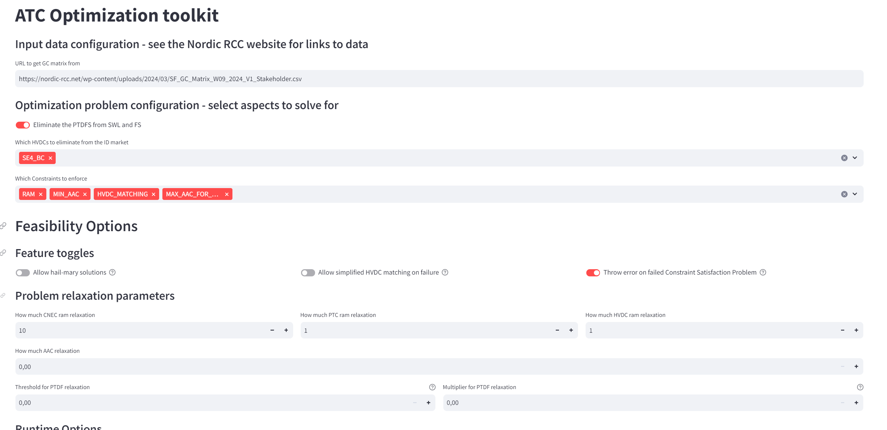

# ATC Extraction tool

## Introduction

This repo contains code to extract NTC/ATC capacities for intraday trading from the Flow Based Market clearing domain. As input, the code takes a Grid Constraint matrix as issued by the nordic RCC [ here ]( https://nordic-rcc.net/flow-based/simulation-results/ ). Simply copy the url link for "Grid Constraint Matrix week [X]" and you are ready to simulate.

You can also compare the results of this optimization with the results provided directly by Nordic RCC. For this, simply copy the url link for "ATCE results week [X]", and paste it into the second URL box. It is also possible to upload a local zip-file by choosing "Local file" instead of URL.

The code in this repo uses an interior point optimizer for convex problems, [clarabel](https://github.com/oxfordcontrol/Clarabel.rs), developed by the Oxford school of engineering. 

## Running the code

The code has dependencies to the solver, data processing packages and the frontend technology we use. To set up the environment install the dependencies with [poetry](https://python-poetry.org/). You begin by issuing the command 

```bash
poetry install
```

To control the optimization and the parameters we have built a frontend in [Streamlit](https://streamlit.io/). The app is contained in the repo and you can launch it by issuing the command

```bash
streamlit run app.py
```

Which will open a new browser window with the UI.




## Features

The repo is almost feature complete:

### Feature toggles

- [x] Add an option to allow the algorithmic removal of corridors from the optimization to find solutions for hours that do not converge - or have no feasible solution. See the hail-mary toggle in the app
- [x] Add an option to perform a simplified HVDC capacity matching by taking the lower of the two ends.
- [x] Add an option to throw an error aborting the run if there are no vectors of NTCs that satisfy all enabled constraints. Very important for developing and debugging!

### Problem relaxation parameters
- [ ] Add an option to adjust the PTDF relaxation on objects. Here there are known bugs that causes a failure to converge
- [x] For fennoscan and SWL - remove columns from PTDF matrix and insert new vectors. Follow BR 2.2 subpoint 2.  Don't do matching afterwards
- [x] ILF 0 for all except for SK = 0.029
- [x] Set the upper limit for Baltic Connect is equal to the AAF (lock-in the value on BC). We also have this feature for FI-NO4, but this is a little unstable.
- [x] Pre process the RAM to allow for AT MINUMUM the AAC flow + epsilon
- [x] Add an option to adjust the RAM relaxation for CNECS, PTCs and the HVDC connection
- [x] Add an option to adjust the AAC relaxation for the corridors 

